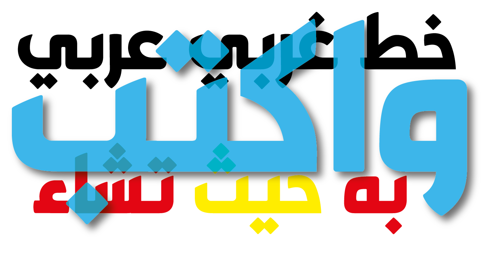

# Gharbi Bold
An old monument in a modern landscape.

Introducing "Gharbi": a font that seamlessly blends the elegance of tradition with the sleekness of modern design. Inspired by the historical Kufi script style, Gharbi has been meticulously redesigned to exude a contemporary vibe while retaining its timeless allure.

This font embraces simplicity, with clean lines and a minimalist approach that ensures clarity and readability across various applications. What sets Gharbi apart is its unique treatment of stroke ends, where each character is delicately adorned with soft touches, adding a sense of refinement and sophistication to every letter.

Gharbi is not just visually captivating; it's also highly versatile and is particularly well-suited for titling in Arabic, Persian, and Kurdish languages, enhancing the beauty and impact of text in these scripts.

Whether used for branding, editorial design, or digital interfaces, Gharbi effortlessly bridges the gap between past and present, offering a timeless elegance with a modern twist. Let your designs speak volumes with the understated charm and versatility of Gharbi.

Two Fonts in One

Gharbi offers the versatility of two distinct styles within a single typeface. Whether you prefer a more traditional look or a contemporary vibe, Gharbi has you covered. With the ability to seamlessly switch between styles or mix and match characters from both, using any standard software, such as Adobe Illustrator, you have the freedom to tailor your designs to suit your unique aesthetic preferences. Embrace the classic elegance of one style, or infuse your designs with a modern flair by seamlessly integrating elements from the other. With Gharbi, the possibilities are endless, allowing you to effortlessly create captivating typography that stands out in any project.

