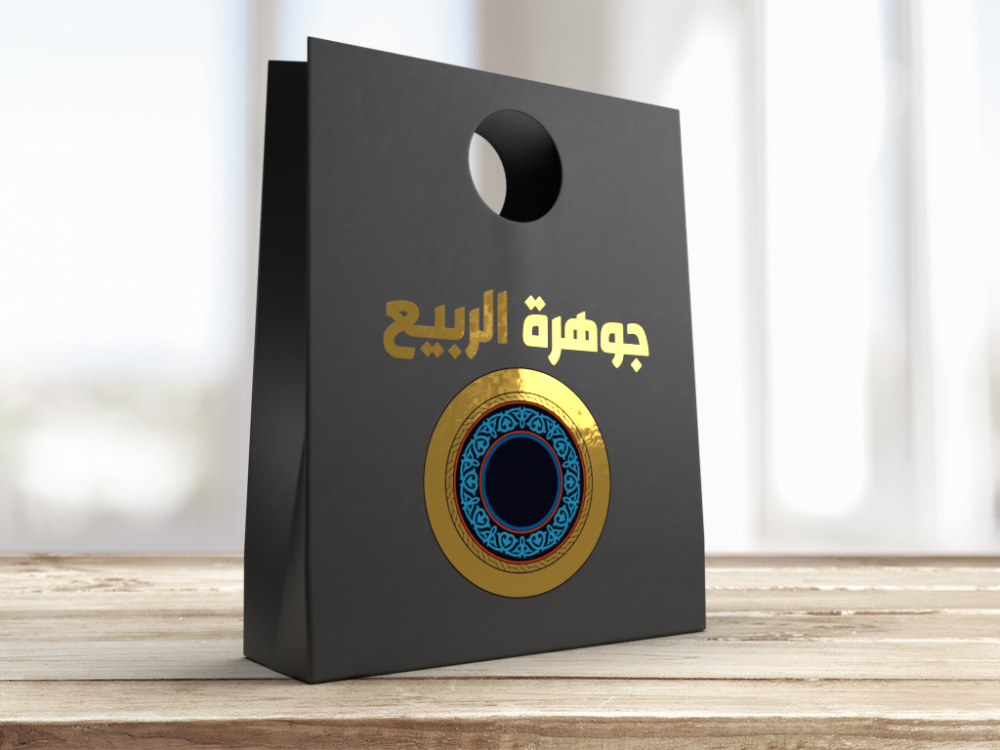

# Gharbi Bold
"An old monument in a modern landscape."

Presenting "Gharbi": a font amalgamating the intricacies of traditional heritage with the precision of contemporary design. Drawing inspiration from the historical Kufi script style, Gharbi has undergone meticulous redesign, imbuing it with a contemporary essence while preserving its timeless charm.

This font prioritizes simplicity, characterized by its streamlined contours and minimalist aesthetic, ensuring optimal legibility and adaptability across diverse applications. Noteworthy is Gharbi's distinctive treatment of stroke ends, where each character is adorned with subtle embellishments, contributing to an aura of sophistication and finesse.

Gharbi transcends mere visual appeal; it boasts remarkable versatility, particularly excelling in titling applications for Arabic, Persian, and Kurdish languages, enhancing the expressive potential of text in these scripts.

Whether employed in branding initiatives, editorial endeavors, or digital interfaces, Gharbi seamlessly traverses epochs, offering a fusion of classical grace and contemporary flair. Let your designs resonate with Gharbi's understated charm and adaptable nature.

Dual Fonts in One

Gharbi introduces a dual-style paradigm, presenting users with the flexibility of two distinct typographic approaches within a single typeface. Whether opting for a traditional demeanor or embracing modern aesthetics, Gharbi caters to diverse preferences. Utilizing standard software like Adobe Illustrator, users can effortlessly transition between styles or blend characters from both, empowering them to customize designs according to their unique sensibilities. Unlock the potential of classical elegance or infuse contemporary dynamism with Gharbi, enabling the creation of beautiful typographic compositions that captivate across all projects.

